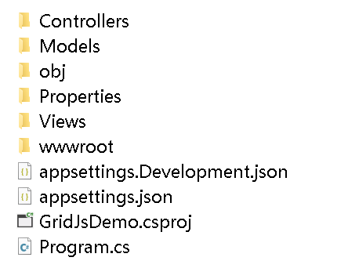

# Load a Spreadsheet with GridJs

## Introduction

This article demonstrates how to **load an Excel workbook into a web page** using the **Aspose.Cells.GridJs** library on the server side and the **gridjs‑spreadsheet** JavaScript library on the client side.  
You will create a **.NET 6 MVC** application, configure the Aspose.Cells.GridJs service, implement a controller that returns the workbook JSON, and write the client‑side HTML/JavaScript that renders the spreadsheet and enables server‑side updates.

> {}
> This guide assumes you have a working **.NET 6 SDK** and **Node.js** installed.  
> All code snippets are self‑contained and can be compiled and run without modification (except for the file‑system paths that you may want to adjust).
> {}

## Prerequisites

| Item | Version | How to obtain |
|------|---------|----------------|
| .NET SDK | 6.0 or later | <https://dotnet.microsoft.com/download> |
| Aspose.Cells | 25.\* (NuGet) | `dotnet add package Aspose.Cells --version 25.*` |
| Aspose.Cells.GridJs | 25.\* (NuGet) | `dotnet add package Aspose.Cells.GridJs --version 25.*` |
| Newtonsoft.Json | 13.0.1 (NuGet) | `dotnet add package Newtonsoft.Json --version 13.0.1` |
| jQuery, jQuery‑UI, JSZip | specific versions listed in the requirement | CDN links are used in the HTML sample |

## Create a .NET 6 MVC Project

Open a terminal and run:

```bash
dotnet new mvc -n GridJsDemo
cd GridJsDemo
```

The generated folder structure looks like this:



> {}
> Ensure the project targets **net6.0** (the default for the template).  
> You can verify this in the `<TargetFramework>` element of **GridJsDemo.csproj**.
> {}

## Server‑Side Setup

### 1. Add Required Packages

```bash
dotnet add package Aspose.Cells --version 25.*
dotnet add package Aspose.Cells.GridJs --version 25.*
dotnet add package Newtonsoft.Json --version 13.0.1
```

### 2. Register GridJs Services

Edit **Program.cs** (or **Startup.cs** if you prefer the classic style) and add the following code inside the `builder.Services` section:

```csharp
// Program.cs
using Aspose.Cells.GridJs;
using Aspose.Cells.GridJs.Configuration;

var builder = WebApplication.CreateBuilder(args);

// Add MVC services
builder.Services.AddControllersWithViews();

// ---------------------------------------------------------------------
// GridJs service registration
// ---------------------------------------------------------------------
builder.Services.AddScoped<IGridJsService, GridJsService>();

builder.Services.Configure<GridJsOptions>(options =>
{
    // • Directory where GridJs caches converted files.
    //   Make sure the folder exists and the application has write permission.
    options.FileCacheDirectory = @"D:\storage\Aspose.Cells.GridJs\";

    // • Base route name for all GridJs actions (e.g. /GridJs/LoadSpreadsheet)
    options.BaseRouteName = "/GridJs";
});

var app = builder.Build();

// ---------------------------------------------------------------------
// Middleware pipeline
// ---------------------------------------------------------------------
if (!app.Environment.IsDevelopment())
{
    app.UseExceptionHandler("/Home/Error");
    app.UseHsts();
}
app.UseHttpsRedirection();
app.UseStaticFiles();

app.UseRouting();

app.UseAuthorization();

// Map default MVC route
app.MapControllerRoute(
    name: "default",
    pattern: "{controller=Home}/{action=Index}/{id?}");

app.Run();
```

> {}
> **Important** – The folder `D:\storage\Aspose.Cells.GridJs\` must exist before you run the application, otherwise GridJs will throw a `DirectoryNotFoundException`.
> {}

### 3. Implement the GridJs Controller

Create a new folder **Controllers** (if not present) and add **GridJsController.cs**:

```csharp
// Controllers/GridJsController.cs
using System.Text;
using Aspose.Cells.GridJs;
using Aspose.Cells.GridJs.Controllers;
using Microsoft.AspNetCore.Mvc;

namespace GridJsDemo.Controllers
{
    // Route prefix matches the BaseRouteName configured earlier.
    [Route("GridJs/[action]")]
    public class GridJsController : GridJsControllerBase
    {
        private readonly IGridJsService _gridJsService;

        public GridJsController(IGridJsService gridJsService) : base(gridJsService)
        {
            _gridJsService = gridJsService;
        }

        // -------------------------------------------------------------
        // Returns the default view that hosts the client‑side UI.
        // -------------------------------------------------------------
        public IActionResult Index()
        {
            return View("Index");
        }

        // -------------------------------------------------------------
        // Loads a workbook, converts it to JSON and returns it.
        // -------------------------------------------------------------
        [HttpGet]
        public ActionResult LoadSpreadsheet(string filename, string uid)
        {
            // Resolve the physical path of the file (e.g. from wwwroot/files)
            string fullFilePath = GetFullFilePath(filename);

            // Generate JSON that includes workbook data, active sheet, etc.
            StringBuilder json = _gridJsService.DetailFileJsonWithUid(fullFilePath, uid);

            // Return plain text (JSON) with UTF‑8 encoding.
            return Content(json.ToString(), "text/plain", Encoding.UTF8);
        }

        // -------------------------------------------------------------
        // Helper: builds the absolute file path.
        // -------------------------------------------------------------
        private string GetFullFilePath(string filename)
        {
            // Example: files are stored under wwwroot/files
            string basePath = Path.Combine(Directory.GetCurrentDirectory(), "wwwroot", "files");
            return Path.Combine(basePath, filename);
        }
    }
}
```

> {}
> The `GridJsControllerBase` already implements actions for cell updates, image handling, OLE download, etc. You only need to add the **LoadSpreadsheet** action (and optionally **Index** if you want a custom view).  
> All URLs used by the client are automatically resolved relative to the `BaseRouteName`.
> {}

### 4. Add a Sample Workbook

Create the folder **wwwroot/files** and place an Excel file, for example **Sample.xlsx**. The file will be used by the demo.

### 5. Create the MVC View

Add a new folder **Views/GridJs** and create **Index.cshtml**:

```html
@{
    Layout = null;   // Simple page without the default layout
}
<!DOCTYPE html>
<html lang="en">
<head>
    <meta charset="utf-8" />
    <title>GridJs Spreadsheet Demo</title>

    <!-- jQuery & jQuery UI -->
    <script src="https://code.jquery.com/jquery-2.1.1.min.js"></script>
    <script src="https://code.jquery.com/ui/1.12.1/jquery-ui.min.js"></script>
    <link rel="stylesheet" href="https://code.jquery.com/ui/1.12.1/themes/base/jquery-ui.css" />

    <!-- JSZip (required by gridjs‑spreadsheet for export) -->
    <script src="https://cdnjs.cloudflare.com/ajax/libs/jszip/3.6.0/jszip.min.js"></script>

    <!-- GridJs Spreadsheet UI -->
    <link rel="stylesheet" href="https://unpkg.com/gridjs-spreadsheet/xspreadsheet.css" />
    <script src="https://unpkg.com/gridjs-spreadsheet/xspreadsheet.js"></script>

    <!-- Custom demo script -->
    <script src="~/js/gridjs-demo.js"></script>

    <style>
        /* Full‑screen container */
        #gridjs-demo-uid {
            width: 100%;
            height: 95vh;
        }
    </style>
</head>
<body>
    <!-- GridJs UI placeholder -->
    <div id="gridjs-demo-uid"></div>
</body>
</html>
```

> {}
> The view uses **Layout = null** to keep the page minimal. If you prefer to use the default layout, remove the line and place the `<div id="gridjs-demo-uid"></div>` inside a section.
> {}

### 6. Client‑Side JavaScript (gridjs‑demo.js)

Create the folder **wwwroot/js** and add **gridjs-demo.js**:

```javascript
/* wwwroot/js/gridjs-demo.js
   --------------------------------------------------------------
   Step‑by‑step script that:
   1. Generates a UUID for the session.
   2. Requests workbook JSON from the server.
   3. Loads the JSON into GridJs Spreadsheet.
   4. Configures server‑side update mode and image handling URLs.
   -------------------------------------------------------------- */

// Utility: generate a RFC4122 version‑4 UUID
function generateUUID() {
    // Simplified but sufficient for demo purposes
    return 'xxxxxxxx-xxxx-4xxx-yxxx-xxxxxxxxxxxx'.replace(/[xy]/g, function (c) {
        const r = Math.random() * 16 | 0,
              v = c === 'x' ? r : (r & 0x3 | 0x8);
        return v.toString(16);
    });
}

// ----------------------------------------------------------------
// Configuration constants – match the routes defined in GridJsController
// ----------------------------------------------------------------
const queryJsonUrl   = "/GridJs/LoadSpreadsheet";
const updateUrl      = "/GridJs/UpdateCell";
const fileDownloadUrl = "/GridJs/Download";
const oleDownloadUrl  = "/GridJs/Ole";
const imageUrl        = "/GridJs/ImageUrl";
const imageUploadUrl1 = "/GridJs/AddImage";
const imageUploadUrl2 = "/GridJs/AddImageByURL";
const imageCopyUrl    = "/GridJs/CopyImage";

// Global GridJs instance
let xs = null;

// ----------------------------------------------------------------
// Main entry point – called when the page finishes loading
// ----------------------------------------------------------------
$(function () {
    const uid = generateUUID();               // Unique session identifier
    const filename = "Sample.xlsx";           // Change if you use a different file

    // Build the request URL with query string parameters
    const requestUrl = `${queryJsonUrl}?filename=${encodeURIComponent(filename)}&uid=${uid}`;

    // ----------------------------------------------------------------
    // 1️⃣ AJAX request: obtain workbook JSON from the server
    // ----------------------------------------------------------------
    $.ajax({
        url: requestUrl,
        method: "GET",
        dataType: "text",          // Server returns plain text (JSON string)
        success: function (responseJsonString) {
            const jsonData = JSON.parse(responseJsonString);
            loadWithOption(jsonData);
        },
        error: function (xhr, status, err) {
            console.error("Failed to load workbook JSON:", err);
        }
    });
});

/**
 * Loads the JSON data into the GridJs UI and applies the required options.
 * @param {Object} jsondata – The deserialized JSON object returned by the server.
 */
function loadWithOption(jsondata) {
    // ----------------------------------------------------------------
    // 2️⃣ Define GridJs load options
    // ----------------------------------------------------------------
    const option = {
        // Server‑side update mode – each cell edit will be POSTed to UpdateCell
        updateMode: 'server',
        updateUrl: updateUrl,
        // UI language (change as needed)
        local: 'en'
    };

    // Clean any previous instance
    $('#gridjs-demo-uid').empty();

    // Extract worksheet array and filename from the server payload
    const sheets = jsondata.data;
    const filename = jsondata.filename;

    // ----------------------------------------------------------------
    // 3️⃣ Initialise GridJs and bind it to the placeholder div
    // ----------------------------------------------------------------
    xs = x_spreadsheet('#gridjs-demo-uid', option)
        .loadData(sheets)
        .updateCellError(function (msg) {
            console.error("Cell update error:", msg);
        });

    // Optional UI tweaks
    if (!jsondata.showtabs) {
        xs.bottombar.hide();               // Hide sheet tabs if not required
    }

    // Store unique identifier and original filename (used by the server)
    xs.setUniqueId(jsondata.uniqueid);
    xs.setFileName(filename);

    // ----------------------------------------------------------------
    // 4️⃣ Set the active sheet and cell (fallback to first sheet if needed)
    // ----------------------------------------------------------------
    let activeSheetName = jsondata.actname;
    if (xs.bottombar.dataNames.indexOf(activeSheetName) >= 0) {
        xs.setActiveSheetByName(activeSheetName)
          .setActiveCell(jsondata.actrow, jsondata.actcol);
    } else {
        // Fallback – first visible worksheet
        activeSheetName = xs.bottombar.dataNames[0];
        xs.setActiveSheetByName(activeSheetName).setActiveCell(0, 0);
    }

    // ----------------------------------------------------------------
    // 5️⃣ Register image‑related and download URLs
    // ----------------------------------------------------------------
    xs.setImageInfo(imageUrl, imageUploadUrl1, imageUploadUrl2, imageCopyUrl, 1000,"/image/loading.gif");
    xs.setFileDownloadInfo(fileDownloadUrl);
    xs.setOleDownloadInfo(oleDownloadUrl);
    xs.setOpenFileUrl("/GridJs/Index"); // URL to reopen the demo page
}
```

> {}
> The script uses **jQuery** for the AJAX call and DOM ready handling. All URLs correspond to the actions provided by `GridJsControllerBase`; you do not need to implement them yourself.
> {}

## Running the Demo

1. **Restore NuGet packages**  

   ```bash
   dotnet restore
   ```

2. **Build and run**  

   ```bash
   dotnet run
   ```

3. Open a browser and navigate to **https://localhost:5001/GridJs/Index** (or the URL displayed in the console).  
   You should see the spreadsheet UI loaded with the content of **Sample.xlsx**.


## Common Issues & Tips

{}
- **Cache directory missing** – Ensure the path set in `GridJsOptions.FileCacheDirectory` exists and the app pool identity can write to it.  
- **CORS errors** – When hosting the client and server on different origins, enable CORS in `Program.cs`.  
- **Large files** – GridJs converts the workbook to JSON in memory; for very large files consider increasing the server memory limit or using pagination features of the library.  
{}


## Demo and Source Code

The complete source code for this tutorial is available in the official Aspose.Cells.GridJs GitHub repository:

<https://github.com/aspose-cells/Aspose.Cells.Grid-for-.NET/tree/main/Examples_GridJs.Simple>

## Additional Resources

* **GridJs Server API** – <https://reference.aspose.com/cells/net/aspose.cells.gridjs>  
* **GridJs Client API** – <https://docs.aspose.com/cells/net/aspose-cells-gridjs/how-to-use-gridjs-client-api/>
* **GridJs‑spreadsheet NPM package** – <https://www.npmjs.com/package/gridjs-spreadsheet>
 


---